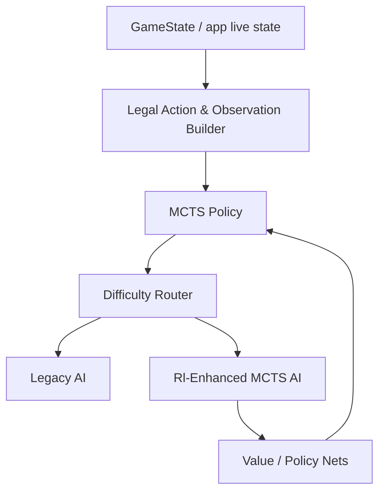

# SETI AI 升级方案：MCTS + RL + 难度分层

本文档描述一套面向当前 SETI 本地模拟器的 AI 升级路线：保留现有 AI 逻辑作为低难度与回退层，新增一个基于 **MCTS + RL** 的更强 AI，并在游戏开始时允许玩家为每个 AI 选择难度。

目标不是追求超人类强度，而是做出一个在 **4 人局、非对称信息、单机算力有限** 约束下，接近熟练普通玩家水平、体验稳定且不会明显拖慢笔记本的 AI。

---

## 1. 设计目标

### 1.1 产品目标

1. 保留现有 AI 逻辑，不破坏当前可用的对战和自动化能力。
2. 支持游戏开始时为每个 AI 单独选择难度，例如：`简单`、`普通`、`困难`。
3. 新增的高难度 AI 使用 **MCTS + RL**，作为更强的决策层。
4. 难度切换应尽量只影响“决策策略”，不要改动规则结算内核。
5. 默认目标是“接近熟练普通玩家”，不是“压制人类顶尖玩家”。

### 1.2 工程目标

1. 训练与推理方案必须适配本地单机：2026 款幻 14 Air，笔记本版 RTX 5060、24 核 CPU、32G 内存。
2. 训练时长优先控制在 **2 小时以内**，上限不超过 **1 天**。
3. 运行时要避免持续高负载导致明显过热，训练和自博弈都要支持限速、分批、暂停和后台恢复。
4. 方案要兼容当前项目结构，优先增量演进，不要求一次性重构成完整独立引擎。

---

## 2. 现状基线

当前项目已有一套可工作的 AI：

1. 顶层行动由 `randomizer/app/ai-controller.js` 统一枚举并打分。
2. 估值、目标、行动图谱、策略选择已拆分到 `randomizer/game/ai/**`。
3. 现有 AI 适合作为：
   - 低难度 AI
   - 新 AI 的规则回退层
   - 训练数据的行为基线

因此，升级方案应当是“**双轨制**”：

1. 旧 AI 继续存在，保证稳定性。
2. 新 AI 以独立策略层接入，在难度更高时被选用。

---

## 3. 总体架构

建议将 AI 分成四层：



### 3.1 难度路由层

游戏开始时，针对每个 AI 玩家记录一个难度配置，例如：

```js
{
  playerId: "player-red",
  difficulty: "hard"
}
```

路由规则建议：

1. `easy`：唯一使用现有 AI 逻辑的难度，作为轻量、稳定、低算力的基线。
2. `normal`：切换到 MCTS + RL，但使用较小的搜索预算和更保守的 rollout 参数。
3. `hard`：使用 MCTS + RL，提升搜索局面数、展开宽度和推理预算。
4. `expert`（可选，不建议默认开放）：仍然使用 MCTS + RL，但采用更高预算；不应改变算法框架，只调参数。

### 3.2 观测层

新 AI 不直接读取“整张牌库的真实隐藏信息”，而应使用 **可观测状态 + 信念状态**：

1. 公共盘面：太阳系、星云、科技板、终局板、公共牌、已揭示外星人、各玩家公开资源。
2. 私有信息：自己的手牌、自己已知的保留牌、自己已抽到但未公开的资源。
3. 推断信息：对手可能手牌、对手牌库剩余组成、对手隐藏科技/任务可能性。

这层应输出一个统一的 `Observation`，供 MCTS 与 RL 共同使用。

### 3.3 搜索层

MCTS 只负责“在当前有限时间内找到更好的动作序列”，不承担长期学习。

建议使用：

1. **Root MCTS**：只在当前决策点做有限预算搜索。
2. **Progressive Widening**：SETI 的合法行动很多，不能一次性全展开。
3. **Action Abstraction**：先在高层行动空间搜索，再展开到具体子选择。
4. **Partial Information Rollout**：模拟时按信念状态采样，而不是读取真实隐藏牌。

### 3.4 学习层

RL 负责两件事：

1. 给状态和行动提供更好的先验概率、价值估计。
2. 从自博弈中持续学习，逐步替代纯手工启发式。

建议优先采用“**策略网络 + 价值网络**”的轻量结构，而不是一开始上重型端到端模型。

---

## 4. 关键约束：非对称信息

SETI 不是完全信息游戏，这一点必须在算法设计里显式处理。

### 4.1 不能直接窥视的信息

训练与推理中，不应使用：

1. 对手手牌明文。
2. 牌库中未抽出的具体牌序。
3. 对手未来必然会做出的隐藏选择。

### 4.2 建议的建模方式

采用 **信念状态（belief state）**：

1. 维护每个对手的手牌分布估计。
2. 维护公共牌库剩余分布估计。
3. 维护对手可能拥有的科技、任务和路线偏好估计。

信念状态不要求完全精确，但要足够用于：

1. 估值当前行动的竞争收益。
2. 评估被抢占、被截胡、被堵路径的风险。
3. 指导 MCTS 的 rollout 采样。

### 4.3 训练时的信息泄漏控制

训练日志和环境接口应强制区分：

1. `public observation`：所有玩家都能看到。
2. `private observation`：当前玩家独有。
3. `hidden ground truth`：仅用于环境推进，不进入训练输入。

建议在环境层做硬约束，避免训练脚本无意把隐藏牌直接喂给模型。

---

## 5. 关键约束：4 人局而不是 2 人对战

这个项目的策略设计不能按“二人零和博弈”去简化。

### 5.1 影响点

1. 行动价值要考虑三名对手的竞争，而不是一个对手。
2. 扇区、登陆位、科技位、终局板块等竞争资源会更快稀缺。
3. 某个行动的价值不仅取决于“我能得到什么”，还取决于“另外三人谁最可能抢走”。

### 5.2 设计建议

1. MCTS rollout 中使用 **4 玩家轮转**，而不是只模拟当前玩家和一个对手。
2. 节点价值不要简单做两人零和转换，应保留“局内排名期望”或“最终分差期望”。
3. RL 的 value target 建议预测：
   - 自己最终得分
   - 自己最终排名概率
   - 或自己相对当前局其他玩家的分位收益

### 5.3 对手建模

推荐增加一个轻量对手模型：

1. 根据当前公开行为为每个对手维护路线偏好。
2. 对手模型只用于概率化的 rollout 和竞争风险评估。
3. 不追求精准预测每一步，只求“足够像熟练玩家”。

---

## 6. MCTS 设计

### 6.1 搜索目标

MCTS 主要负责当前决策点的顶层行动选择，例如：

1. 发射、环绕、登陆、扫描、分析、打牌、科技、快速行动、PASS。
2. 对会触发后续子选择的行动，先评估“行动主干”再评估子选择。

### 6.2 节点定义

建议把节点分成两类：

1. **决策节点**：当前玩家要选一个可行动作。
2. **随机节点**：抽牌、翻牌、未知信息采样、对手隐藏信息采样。

### 6.3 动作展开策略

SETI 的行动空间较大，不能一次性穷举全部细节，建议采用三段式展开：

1. **主行动层**：launch / orbit / land / scan / analyze / playCard / researchTech / pass。
2. **子选择层**：目标星云、科技槽位、卡牌选择、移动路径、支付方式等。
3. **深展开层**：只对最有希望的少量分支继续展开。

### 6.4 Progressive Widening

推荐使用渐进扩展：

1. 先按先验分数取前 N 个候选。
2. 随访问次数增长逐步加入更多候选。
3. 对显然劣势的分支尽早剪枝。

这样可以控制树宽，避免在 4 人局和复杂子流程中爆炸。

### 6.5 Rollout 策略

Rollout 不应纯随机，建议分层：

1. 低预算：继续沿用现有启发式 AI 作为 rollout policy。
2. 中预算：使用轻量策略网络引导的半随机 rollout。
3. 高预算：混合启发式 + 小型 value net。

这能让旧 AI 成为新 AI 的“模拟器”，减少训练前期噪声。

---

## 7. RL 设计

### 7.1 学习目标

建议不要一开始做纯自回归动作模仿，而是做“**策略 + 价值 + 结果监督**”三段式：

1. 策略头：预测当前动作分布。
2. 价值头：估计当前局面未来收益。
3. 结果头：预测若干关键事件，如是否能抢到关键扇区、是否完成特定路线、最终排名区间。

### 7.2 训练数据来源

1. 自博弈局面。
2. 现有 AI 与新 AI 的对局日志。
3. 启发式搜索产生的高质量样本。
4. 人类试玩日志（如果后续能收集）。

### 7.3 训练方法建议

推荐优先采用以下路线：

1. **行为克隆预训练**：先模仿现有 AI 和少量高质量规则策略。
2. **自博弈强化学习**：再用 MCTS 生成改进目标。
3. **离线 + 在线混合训练**：离线更新模型，在线只做推理。

这样比一上来直接端到端 RL 更稳，也更适合你给出的时间预算。

### 7.4 奖励设计

奖励不要只看最终胜负，建议做密集与稀疏结合：

1. 主奖励：最终分数、排名、胜率。
2. 中间奖励：有效得分、完成扇区、科技进展、数据分析、任务完成。
3. 竞争奖励：抢占关键目标、阻断对手关键路线。
4. 负奖励：无效 PASS、长期卡手、重复做低收益行动、浪费移动和扫描。

SETI 的局势波动大，若只靠终局奖励，样本效率会偏低。

---

## 8. 难度分层方案

### 8.1 建议的难度梯度

1. `easy`：现有 AI，作为唯一的旧逻辑难度。
2. `normal`：MCTS + RL，低预算。
3. `hard`：MCTS + RL，中等预算。
4. `expert`：MCTS + RL，高预算，仍需受限于笔记本温度和响应时间。
5. `training`（可选）：用于自博弈和调参，不建议作为正式游戏难度展示。

### 8.2 各难度建议策略

| 难度 | 决策策略 | 搜索预算 | 适用目标 |
|---|---|---:|---|
| easy | 现有启发式 AI | 很低 | 新手体验、快速对局 |
| normal | MCTS + RL | 低 | 熟练普通玩家 |
| hard | MCTS + RL | 中 | 稳定强度、接近熟练玩家上限 |
| expert | MCTS + RL | 中高 | 仅实验用途 |

### 8.3 UI 交互建议

1. 开局时在玩家配置面板选择每个 AI 的难度。
2. 允许同局混合难度，例如一个 `hard`、两个 `normal`。
3. 保存上次选择，减少每局重复设置。

---

## 9. 训练算力与时间预算

你给出的机器配置足够做“中等规模、本地可控”的训练，但不适合长时间高强度大模型训练。

### 9.1 约束原则

1. 训练优先使用轻量模型，别上超大 Transformer。
2. 自博弈和 MCTS 的预算要明确上限。
3. 训练进程必须支持暂停、恢复、分阶段导出。
4. 运行时要限制每步思考时间，避免把笔记本长期顶满。

### 9.2 推荐预算

面向“接近熟练普通玩家”的目标，建议：

1. 单步搜索时间：普通难度 10-50ms，困难难度 50-200ms。
2. 每局自博弈的 MCTS 节点预算：先从低几百到低几千节点起步。
3. 训练 batch 尽量小而频繁，避免一次性占满 32G 内存。
4. 每轮训练后做短评估，而不是长时间盲跑。

### 9.3 温控建议

1. 默认训练线程数不要直接拉满 24 核，可从 8-12 线程开始。
2. GPU 训练优先使用混合精度和固定小 batch。
3. 支持每轮训练后冷却间隔或自动降频策略。
4. 长时间批跑要允许降到纯 CPU 小步推理，以防持续烫手。

### 9.4 训练时间目标拆分

如果希望总训练时长控制在 2 小时内，建议拆成：

1. 20-30 分钟：行为克隆预训练。
2. 30-60 分钟：小规模自博弈 + MCTS 数据采样。
3. 20-40 分钟：离线 RL 或价值头微调。
4. 10-20 分钟：回归评估与模型选择。

如果要扩展到 1 天以内，可增加更多轮次，但仍建议分段执行。

---

## 10. 推荐的落地路线

### 阶段 1：接入难度系统

1. 在开局配置中增加每个 AI 的难度选择。
2. 维持现有 AI 仅作为 `easy` 基线。
3. `normal` 及以上全部走 MCTS + RL 路线，通过参数调节强度，不再走旧逻辑。
4. 在调度层加入难度路由，不改变规则内核。

### 阶段 2：抽象观测与合法行动

1. 从当前 live state 提炼统一 `Observation`。
2. 补一个显式的合法行动枚举层，供 MCTS 使用。
3. 把主行动、子选择、随机事件拆开建模。

### 阶段 3：先做启发式 MCTS

1. 用现有 AI 作为 rollout policy。
2. 用手工价值函数做 root prior 和 value estimate。
3. 验证 4 人局、非对称信息、长回合场景下的稳定性。

### 阶段 4：接入轻量 RL

1. 先做行为克隆。
2. 再做自博弈强化学习。
3. 逐步把策略 prior 和 value 评估替换为模型输出。

### 阶段 5：调参与降载

1. 用对局日志评估不同难度的强度区间。
2. 调整每档难度的预算上限。
3. 确保默认开局在笔记本上不会显著发热或掉帧。

---

## 11. 成功标准

建议用下面几条作为验收标准：

1. `easy` 难度与当前 AI 表现接近。
2. `normal` 难度明显更稳，但仍能快速响应。
3. `hard` 难度能接近熟练普通玩家，不追求碾压级优势。
4. 单机训练在合理温控下可在 2 小时内完成一个可用版本。
5. 最坏情况下，总训练与评估不超过 1 天。
6. 游戏过程中不出现明显卡顿、发热失控或长时间无响应。

---

## 12. 需要同步修改的代码方向

如果后续开始落地，建议优先修改这些区域：

1. `randomizer/app/public-api.js`：暴露难度配置接口。
2. `randomizer/app/ai-controller.js`：增加难度路由与 MCTS AI 接入点。
3. `randomizer/game/ai/**`：新增 MCTS、RL、观测、模型接口。
4. `randomizer/app.js`：开局配置面板增加 AI 难度选择。
5. 测试层：增加 4 人局、隐藏信息、不同难度混合配置的回归测试。

---

## 13. 风险与取舍

1. **非对称信息是核心难点**：如果把隐藏信息直接喂给模型，训练出来的 AI 会“作弊”，上线后会显著退化。
2. **4 人局的搜索复杂度高**：必须控制分支数，否则 MCTS 很快爆炸。
3. **笔记本热量限制会影响预算**：模型不能太大，MCTS 节点数不能过高。
4. **只用 RL 不够稳**：建议始终保留规则启发式作为安全回退。
5. **强度目标不应过高**：你的目标是“接近熟练普通玩家”，不是冲顶级对弈，因此要优先稳定和响应速度。

---

## 14. 建议结论

最可行的路线不是立刻重做一个完全新的 AI，而是：

1. 保留现有 AI 只作为 `easy` 难度。
2. `normal` / `hard` / `expert` 全部使用 MCTS + RL，只通过搜索预算、rollout 数、展开宽度、温度与评估时长调强度。
3. 先把“难度路由、统一观测、合法行动枚举”做出来。
4. 再在此基础上引入轻量 MCTS，并逐步接入 RL 的先验与价值估计。
5. 以“接近熟练普通玩家、2 小时级别训练、笔记本可控温度”为边界反复收敛。

这会比直接从零训练一个端到端 AI 更稳，也更符合当前项目的结构。

---

## 15. 具体任务表

下面这份任务表按“先可落地、后增强”的顺序排列。推荐实现顺序是从上到下，不要跳步。

### 15.1 技术栈建议

| 层级 | 建议技术栈 | 用途 |
|---|---|---|
| 游戏运行层 | 现有 JavaScript / 浏览器内逻辑 | 保留当前规则内核与 UI 行为 |
| 调度与接线层 | JavaScript，必要时少量 TypeScript 类型文件 | 做难度路由、AI 选择、与现有 `app.js` / `ai-controller.js` 对接 |
| 训练与搜索层 | Python 3.11+ | 训练、自博弈、MCTS 采样、RL 更新更适合 Python 生态 |
| 张量框架 | PyTorch | 策略网络、价值网络、批量训练、混合精度 |
| 数值与数据处理 | NumPy / pandas / pyarrow（可选） | 对局日志处理、样本缓存、训练集构建 |
| 模型导出 | ONNX（可选） | 若后续希望推理侧脱离 Python，可导出轻量模型 |
| 任务编排 | `npm` 仅用于前端，训练脚本用 Python CLI | 不建议强行把训练塞回浏览器进程 |

### 15.2 任务拆分表

当前进度（落盘版）：

#### 总任务清单

- [x] T1 难度路由
- [x] T2 无头训练环境接口（新增前置）
- [x] T3 统一观测提取
- [x] T4 合法行动枚举层（新增前置）
- [x] T5 隐藏信息边界隔离（新增前置）
- [x] T6 统一随机种子与可复现流水线（新增前置）
- [x] T7 旧 AI 回退封装
- [x] T8 数据记录器
- [x] T9 MCTS 原型
- [x] T10 信念状态与隐藏信息采样
- [x] T11 轻量策略网络
- [x] T12 轻量价值网络
- [x] T13 行为克隆预训练
- [x] T14 自博弈训练
- [x] T15 难度参数表
- [x] T16 运行时接入
- [x] T17 性能与温控
- [x] T18 回归评估

#### 当前进度

- [x] 已落盘任务表、参数表与 M0 前置说明。
- [x] 控制器内已接入 difficulty 路由，`easy` 保留旧逻辑，`normal/hard/expert` 走搜索型分支。
- [x] `seed` / `observation` / `environment` 三个基础模块已落地，并通过 `SetiRandomizer` 公开入口暴露。
- [x] T2 无头训练环境接口已落地。
- [x] T3 统一观测提取已落地。
- [x] T4 合法行动枚举层已落地。
- [x] T5 隐藏信息边界隔离已落地。
- [x] T6 统一随机种子与可复现流水线已落地。
- [x] 开局配置面板的 per-AI 难度选择已接到 UI。

| 编号 | 任务 | 主要产出 | 技术栈 | 关键参数 / 配置 | 验收标准 |
|---|---|---|---|---|---|
| T1 | 难度路由 | 每个 AI 玩家可配置 `easy/normal/hard/expert` | JS + 现有 app 层 | `easy=legacy`；其余难度均走 MCTS+RL | 开局能为每个 AI 单独选难度，且不会破坏现有对局 |
| T2 | 无头训练环境接口（新增前置） | 统一 `reset/step/observe/legal_actions` API | JS（可后续补 TS 类型） | 与 UI 解耦；支持 4 人局；可在无 DOM 环境运行 | 训练脚本可直接调用环境，不依赖 overlay/pending UI 交互 |
| T3 | 统一观测提取 | `Observation` 对象与序列化格式 | JS 先做，Python 复用 | 只包含公共信息 + 自己私有信息 + 信念状态摘要 | 训练/推理不读隐藏对手手牌明文 |
| T4 | 合法行动枚举层（新增前置） | 显式 action list / action mask | JS 运行时 + Python 训练镜像 | 主行动、子选择、随机节点分离；保留 `available/reason` | MCTS 与旧 AI 都可复用同一套合法动作生成逻辑 |
| T5 | 隐藏信息边界隔离（新增前置） | `public/private/hidden` 三层状态接口 | JS + Python 数据管线 | 训练输入只用 public + 当前玩家 private | 代码审查可证明无 hidden ground truth 泄漏到训练特征 |
| T6 | 统一随机种子与可复现流水线（新增前置） | 全链路 seed 控制与对局重放脚本 | JS + Python | `seed` 注入到抽牌/洗牌/补牌/采样；支持固定 seed 回放 | 同 seed 运行结果一致（允许浮点微差），A/B 对照稳定 |
| T7 | 旧 AI 回退封装 | 现有 AI 作为 `easy` 的稳定后备 | JS | 维持当前启发式策略；作为 rollout policy 备份 | `easy` 难度行为与现有版本一致或近似一致 |
| T8 | 数据记录器 | 自博弈日志、局面缓存、奖励标注 | JS 导出 + Python 解析 | 记录每一步 action、候选、隐藏采样种子、终局分数 | 能批量生成训练样本，且可复现实验 |
| T9 | MCTS 原型 | 4 人局 root MCTS | Python | `simulations_per_move=64~512`；`max_depth=4~8`；`cpuct=1.0~2.5`；`progressive_widening=true` | 在固定局面能稳定返回合法动作，不超时、不爆内存 |
| T10 | 信念状态与隐藏信息采样 | 对手手牌/牌库的分布采样器 | Python | 每次 rollout 采样 1~4 组 belief；避免直接窥视 ground truth | 搜索过程在隐藏信息下仍能运行，且不泄漏信息 |
| T11 | 轻量策略网络 | policy net 雏形 | PyTorch | 输入维度=Observation；网络深度 2~4 层 MLP/Transformer-lite；`hidden_size=128~256` | 能输出动作先验分布，且推理足够快 |
| T12 | 轻量价值网络 | value net 雏形 | PyTorch | `value_head` 预测最终分或排名；`hidden_size=128~256` | 对局面价值排序比随机/纯启发式更稳定 |
| T13 | 行为克隆预训练 | 第一版可用模型 | PyTorch | `batch_size=64~256`；`lr=1e-4~3e-4`；`epochs=3~10`；`grad_clip=1.0` | 模型能模仿现有 AI 的基本路线，且不发散 |
| T14 | 自博弈训练 | RL 数据闭环 | Python + PyTorch | `self_play_games=200~2000` 起步；`temperature=0.8~1.2`；`replay_buffer` 启用 | 训练后在固定 seed 对局中比基线更稳 |
| T15 | 难度参数表 | 不同难度的预算配置 | Python / JS 配置文件 | `normal`: 64 sims；`hard`: 192 sims；`expert`: 512 sims；`time_limit_ms`: 50/120/250；`rollout_depth`: 3/5/7 | 同一模型在不同预算下体现出明显强度差 |
| T16 | 运行时接入 | AI 调度器切换到新策略 | JS + 少量 Python 推理接入 | `easy=legacy`；`normal+` 调 MCTS+RL；保留人工 fallback | 浏览器对局中可切换 AI 难度 |
| T17 | 性能与温控 | 限速、降载、后台批跑 | Python CLI + JS 调度 | 单步预算上限；线程数 8~12；批间冷却 1~3s；GPU mixed precision | 笔记本长时间运行不明显过热，且不会卡死 |
| T18 | 回归评估 | 基准局面集与 A/B 报告 | Python | 固定 seed、固定局面集、平均分/胜率/耗时/温度日志 | 能明确比较不同难度和模型版本的提升 |

### 15.3 推荐参数表

下面这些是建议初始值，不是最终值。目标是先跑通，再逐步加大预算。

| 参数名 | easy | normal | hard | expert | 说明 |
|---|---:|---:|---:|---:|---|
| `mcts_simulations_per_move` | 0 | 64 | 192 | 512 | 每个决策点模拟次数 |
| `mcts_max_depth` | 0 | 4 | 6 | 8 | MCTS 最大展开深度 |
| `mcts_cpuct` | 0 | 1.8 | 1.5 | 1.2 | 探索系数，越高越偏探索 |
| `mcts_progressive_widening_k` | 0 | 8 | 12 | 16 | 每层最多逐步放开的分支数 |
| `mcts_rollout_depth` | 0 | 3 | 5 | 7 | rollout 深度 |
| `policy_temperature` | 高 | 0.9 | 0.7 | 0.5 | 采样温度，越低越确定 |
| `decision_time_limit_ms` | 0 | 50 | 120 | 250 | 单次思考预算 |
| `self_play_threads` | 0 | 8 | 10 | 12 | 自博弈并行线程数 |
| `train_batch_size` | 0 | 128 | 192 | 256 | 训练 batch |
| `learning_rate` | 0 | 2e-4 | 1e-4 | 8e-5 | 学习率 |
| `replay_buffer_size` | 0 | 50k | 100k | 200k | 经验回放缓存 |

### 15.4 里程碑顺序

1. 先做 T1-T6，先打通训练前置能力：环境接口、合法行动、信息边界、可复现。
2. 再做 T7-T10，确保旧 AI 回退和 MCTS 原型可用。
3. 然后做 T11-T14，完成模型、行为克隆与自博弈训练闭环。
4. 接着做 T15-T16，落地不同难度参数和运行时接入。
5. 最后做 T17-T18，完成温控和系统化评估。

### 15.5 开训前阻塞项（必须先完成）

以下 4 项是“开始稳定 MCTS+RL 训练”前的硬前置：

1. `T2` 无头训练环境接口：否则训练仍被 UI/pending 流程耦合。
2. `T4` 统一合法行动枚举：否则 MCTS 和策略网络的 action space 不稳定。
3. `T5` 隐藏信息边界隔离：否则会产生信息泄漏，训练结果失真。
4. `T6` 统一随机种子与可复现流水线：否则 A/B 比较不可可信。

建议将这 4 项定义为里程碑 `M0`，未完成前不进入大规模自博弈训练。

### 15.6 推荐的第一版交付边界

如果要控制在较短周期内落地，第一版建议只做：

1. `easy` 保持现有逻辑。
2. `normal/hard/expert` 共用同一个 MCTS+RL 框架。
3. 先不追求很深的网络结构，优先做轻量 policy/value net。
4. 先以固定参数区分难度，不做动态自适应调参。
5. 先把 4 人局和隐藏信息跑稳，再继续提高强度。