# 《SETI：星空觅迹》规则摘要与本地程序自动化设计笔记

> 目标：这份摘要不是逐字规则翻译，而是把规则书中的核心流程、典型图标、状态变化和可程序化的判定点整理出来，方便后续开发本地规则辅助/自动化程序。

---

## 1. 一句话理解游戏

玩家扮演太空探索机构，在 **5 轮**中通过发射探测器、探索太阳系、扫描邻近恒星、分析数据、研究科技和打出项目卡，寻找并研究外星生命。核心竞争来自三个方向：

1. **太阳系探索**：移动探测器，绕行行星成为人造卫星，或在行星/卫星着陆。
2. **深空扫描**：在扇区标记信号，获取数据并争夺扇区奖励。
3. **科研推进**：分析数据、研究科技、完成任务、触发里程碑和发现外星生物。

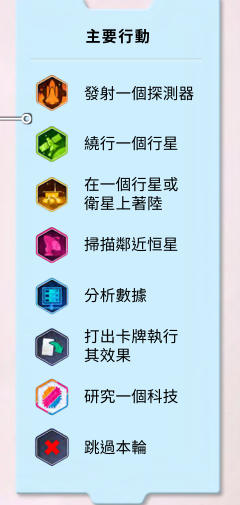

---

## 2. 游戏整体流程

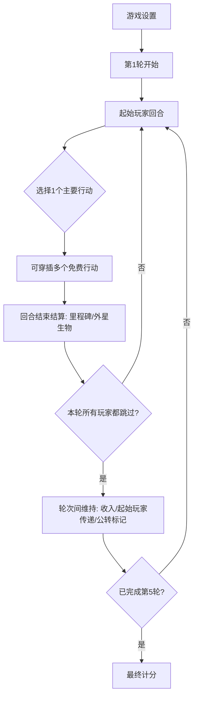

### 回合结构

每个玩家回合通常是：

1. 执行任意数量的**免费行动**。
2. 执行 **1 个主要行动**。
3. 继续执行任意数量的**免费行动**。
4. 结束回合，结算里程碑与已发现外星生物效果。

> 注意：免费行动只能在自己的回合中执行，不能在其他玩家回合或轮次间执行。

---

## 3. 典型资源与通用图标

| 图标/概念 | 程序字段建议 | 含义 | 自动化处理要点 |
|---|---:|---|---|
| 信用点 | `credits` | 支付发射、绕行、扫描、打牌等费用 | 资源不足则行动非法 |
| 能量 | `energy` | 支付移动、着陆、扫描、分析等费用 | 可转化为移动力 |
| 推广 | `publicity` | 推进玩家推广条，研究科技需要 6 点 | 上限为 10，超出浪费 |
| 卡牌 | `hand[]` | 项目、任务、免费行动、收入来源 | 手牌在平时无上限，跳过时通常保留 4 张 |
| 数据 | `data_pool`, `computer_slots` | 扫描获得，放入计算机后可分析 | 数据池上限 6，满了再获得则弃置 |
| 分数 | `score` | 胜负核心 | 到达 20/25/30/50/70 等节点会触发里程碑逻辑 |
| 移动力 | `move_points` | 探测器在太阳系版图移动 | 离开小行星通常额外 +1 移动力 |
| 收入 | `income_cards[]` | 每轮维持阶段获得的资源 | 插入收入牌时立即获得，之后每轮再获得 |

---

## 4. 卡牌结构：一张牌有多种用途

卡牌是程序化时最容易出错的部分，因为每张牌通常不是单一效果。规则书中卡牌结构可抽象为：

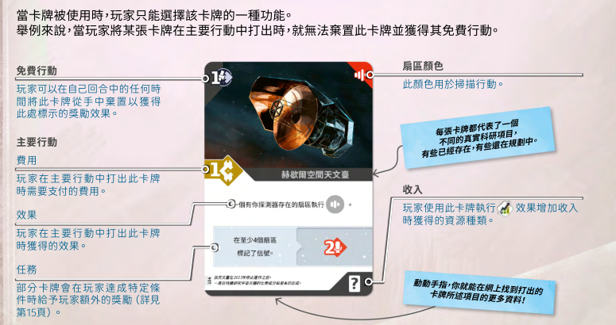

| 卡牌区域 | 含义 | 程序建模建议 |
|---|---|---|
| 左上/上方免费行动 | 可以在自己回合任意时机弃置此牌获得效果 | `free_effect` |
| 主要行动费用 | 打出此牌作为主要行动时支付的费用 | `main_cost` |
| 白色效果框 | 打出牌后执行的主要效果 | `main_effect` |
| 右上角扇区颜色 | 扫描时决定此牌对应的扇区 | `sector_color` |
| 右下角收入 | 插入收入区时每轮提供的资源 | `income_reward` |
| 任务/金色计分框 | 条件任务、触发任务或游戏结束计分 | `card_type = mission/end_scoring/...` |

程序里建议把“一张牌被使用的方式”建模为互斥枚举：

```ts
type CardUseMode =
  | "discard_for_free_action"
  | "play_as_main_action"
  | "insert_as_income"
  | "select_from_end_round_offer";
```

同一张牌在一次使用中只能选择一种用途。

---

## 5. 八类主要行动

### 5.1 发射一个探测器

- 费用：通常支付 **2 信用点**。
- 效果：从个人供应区拿 1 个玩家模型，放到地球位置。
- 限制：默认每位玩家在太空中只能拥有 **1 个探测器**。
- 不计入太空探测器的模型：已经放到行星版图上的人造卫星或着陆器。

程序判定：

```ts
canLaunch(player) = player.credits >= 2
  && player.space_probes.length < player.probe_limit
```

### 5.2 移动探测器（免费行动）

- 每支付 1 点能量，获得 1 点移动力。
- 某些卡牌也可弃置获得移动力。
- 每 1 点移动力通常移动到相邻格。
- 不能停留或移动经过太阳。
- 离开小行星位置通常额外消耗 1 点移动力。
- 进入带有推广图标的位置时，获得 1 推广。

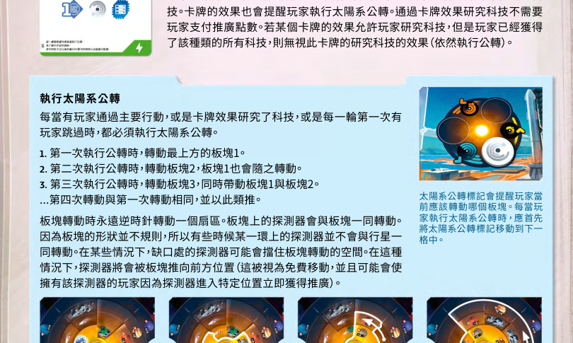

### 5.3 绕行一个行星

- 费用：通常 **1 信用点 + 1 能量**。
- 条件：自己的探测器位于某个非地球行星位置。
- 效果：移除太阳系中的探测器，将模型放到对应行星轨道，成为人造卫星。
- 常见收益：分数、资源、数据、推广等；第一个绕行该行星的玩家额外获得对应首位奖励。

### 5.4 在行星或卫星上着陆

- 费用：通常 **3 能量**；若该行星已有任意玩家的人造卫星，费用降为 **2 能量**。
- 条件：自己的探测器位于某个非地球行星位置。
- 效果：移除太阳系中的探测器，将模型放到对应行星/卫星位置，成为着陆器。
- 着陆是发现某类生命迹象的主要方式。
- 卫星通常需要科技或卡牌效果才可着陆；每个卫星只能有 1 个着陆器。


### 5.5 扫描邻近恒星

- 费用：通常 **1 信用点 + 2 能量**。
- 效果：在扇区中标记信号，获得数据。
- 基础扫描通常至少标记 2 个信号：
  - 在地球所在扇区标记 1 个信号。
  - 从卡牌供给区弃置 1 张牌，在其右上角颜色对应的扇区标记 1 个信号。
- 望远镜科技可让一次扫描标记更多信号或改变标记位置。

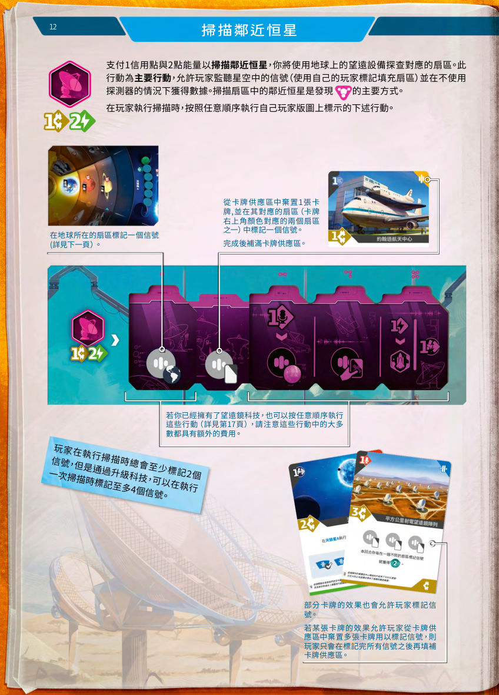

### 5.6 分析数据

- 费用：通常 **1 能量**。
- 条件：玩家计算机上方行所有位置已被数据填满。
- 效果：弃置计算机中的数据，在外星生物上标记对应生命迹象。
- 数据池上限为 6；放入计算机是免费行动。

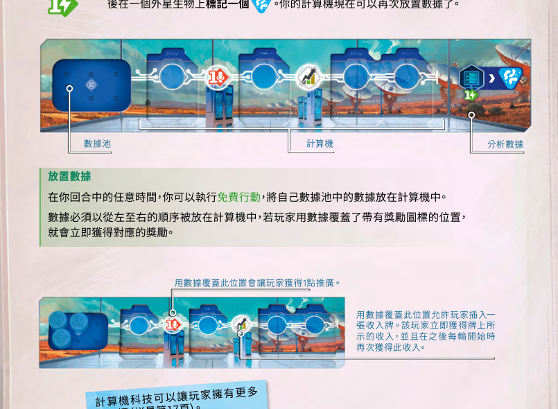

### 5.7 打出卡牌

- 作为主要行动，从手牌打出 1 张卡并执行白色效果框中的效果。
- 若效果中包含发射、扫描、绕行等行动，通常不再支付这些行动的基础费用，除非卡牌另有说明。
- 任务牌和游戏结束计分牌通常保留在玩家面前；其他牌结算后进入弃牌堆。

### 5.8 研究一个科技

- 费用：通常 **6 推广**。
- 研究前必须先执行一次太阳系公转。
- 选择一个自己尚未拥有的科技，获得最上方科技板块和其一次性奖励。
- 若自己是第一个拿取该科技堆的玩家，还会获得该堆上的 2 分奖励。


科技分为三类：

| 科技类型 | 作用方向 | 程序字段建议 |
|---|---|---|
| 探测器科技 | 增强探测器数量、移动、小行星、着陆/卫星能力 | `probe_techs[]` |
| 望远镜科技 | 强化扫描行动，可改变/增加标记信号方式 | `telescope_techs[]` |
| 计算机科技 | 扩展计算机数据槽和覆盖奖励 | `computer_techs[]` |

---

## 6. 扇区与信号：扫描系统的核心

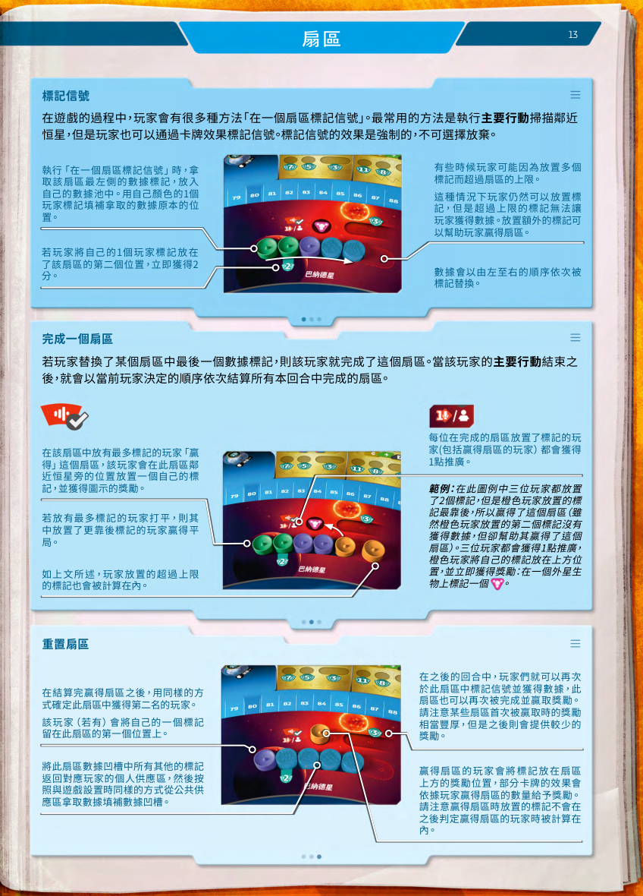

### 标记信号

当玩家在一个扇区标记信号时：

1. 拿取该扇区最左侧的数据，放入自己的数据池。
2. 用自己的玩家标记替换该数据位置。
3. 若放在该扇区第 2 个位置，立即获得 2 分。
4. 若数据已满但仍放置额外标记，额外标记不能获得数据，但仍会参与“谁赢得扇区”的比较。

### 完成扇区

当最后一个数据被替换时，该扇区完成。主要判定逻辑：

1. 该扇区中标记最多的玩家赢得扇区。
2. 若平手，位置更靠后的标记所属玩家获胜。
3. 所有在该扇区放置过标记的玩家获得 1 推广。
4. 获胜者获得扇区奖励，并在扇区上方放置胜利标记。
5. 重置扇区：第二名玩家可保留 1 个标记在第一格，其余标记返回，重新填充数据。

程序建议实现：

```ts
function resolveSector(sector: Sector): SectorResult {
  const counts = countMarkersIncludingOverflow(sector);
  const winner = breakTieByFarthestMarker(counts, sector.marker_positions);
  const runnerUp = findRunnerUpAfterWinner(sector);
  return { winner, runnerUp, participants, rewards };
}
```

---

## 7. 外星生物与生命迹象

游戏开始时从 5 种外星生物中随机抽取 2 种，正面朝下。玩家通过三类生命迹象推动发现：

| 生命迹象来源 | 主要获得方式 | 程序事件 |
|---|---|---|
| 扫描类生命迹象 | 赢得扇区扫描奖励 | `on_win_sector` |
| 着陆类生命迹象 | 在行星/卫星着陆 | `on_land` |
| 分析类生命迹象 | 分析数据 | `on_analyze_data` |
| 通用生命迹象 | 可视为任意颜色 | `wild_life_sign` |

当某个外星生物下方 3 个发现位置都被填满时，该外星生物被发现。发现时：

1. 翻开对应外星生物版图。
2. 查看对应外星生物规则。
3. 按外星生物规则进行设置。
4. 参与发现的玩家获得对应奖励。

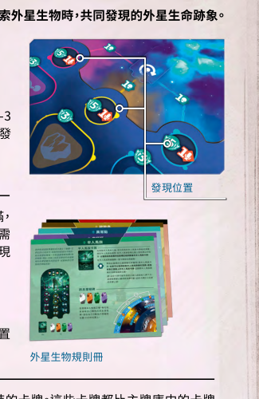

程序上建议把外星生物规则做成插件式模块：

```ts
interface AlienModule {
  id: string;
  onDiscovered(game: GameState): GameState;
  onLifeSignPlaced?(event: LifeSignEvent, game: GameState): GameState;
  endGameScoring?(game: GameState): ScoreDelta[];
}
```

这样基础规则引擎不需要提前写死 5 种外星生物的全部特殊规则。

---

## 8. 里程碑、跳过与轮次维持

### 金色里程碑

当玩家分数到达或超过 **25 / 50 / 70** 时，在回合结束后选择一个金色里程碑放置标记。每位玩家每个金色里程碑只能选择一次。

### 中立里程碑

少于 4 人游戏时，在 20 分和 30 分位置放置中立标记。玩家到达或超过这些位置时，中立科研组织会推进外星生物发现位置，可能导致外星生物被发现。

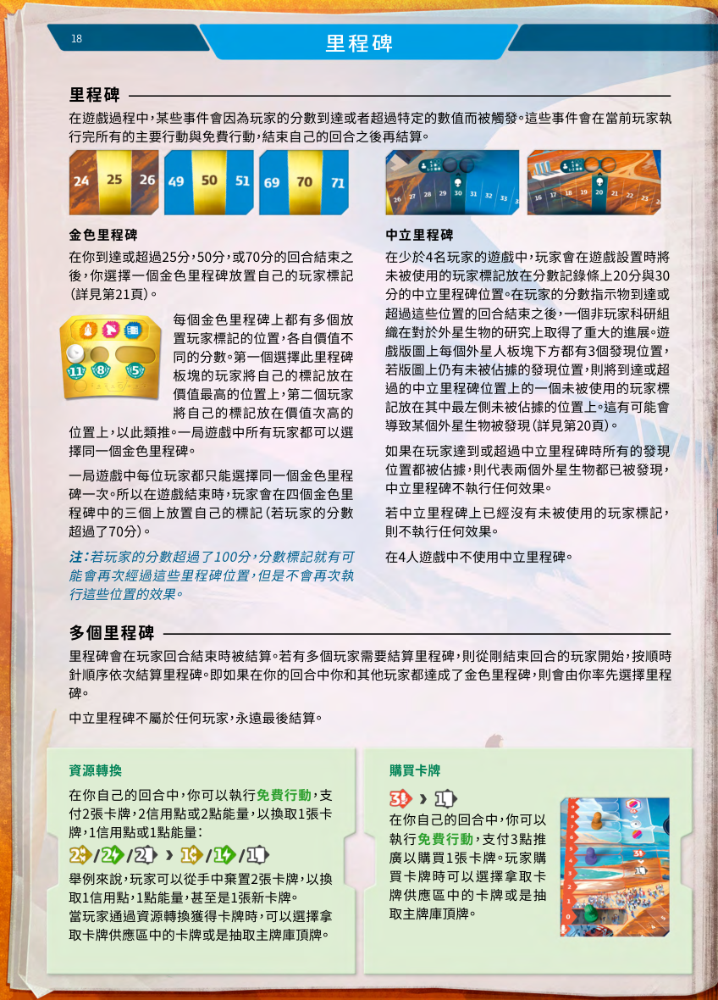

### 跳过本轮

跳过也是一个主要行动。执行跳过时：

1. 若手牌超过 4 张，保留 4 张，弃掉其余手牌。
2. 若自己是本轮第一个跳过的玩家，执行太阳系公转。
3. 从当前轮的一轮结束牌中选择 1 张获得。
4. 该轮中不能再执行任何行动。

所有玩家都跳过后进入维持阶段：

1. 所有玩家获得收入。
2. 起始玩家标记顺时针传递。
3. 公转标记放到下一叠一轮结束牌上。

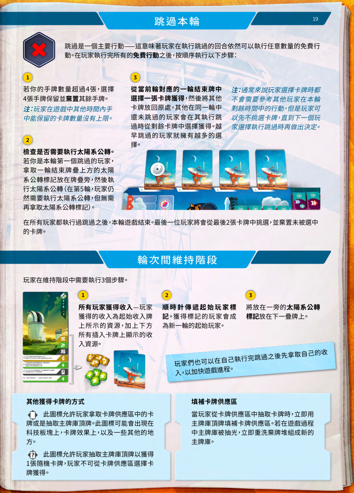

---

## 9. 游戏结束与计分

游戏在第 5 轮结束后结束。最终得分包括：

1. 游戏过程中已获得分数。
2. 打出的游戏结束计分牌分数。
3. 金色里程碑分数。
4. 已发现外星生物提供的额外计分。

金色里程碑可能按以下类别计分：科技组合、任务完成数量、收入组合、生命迹象组合、扇区胜利与模型数量组合等。

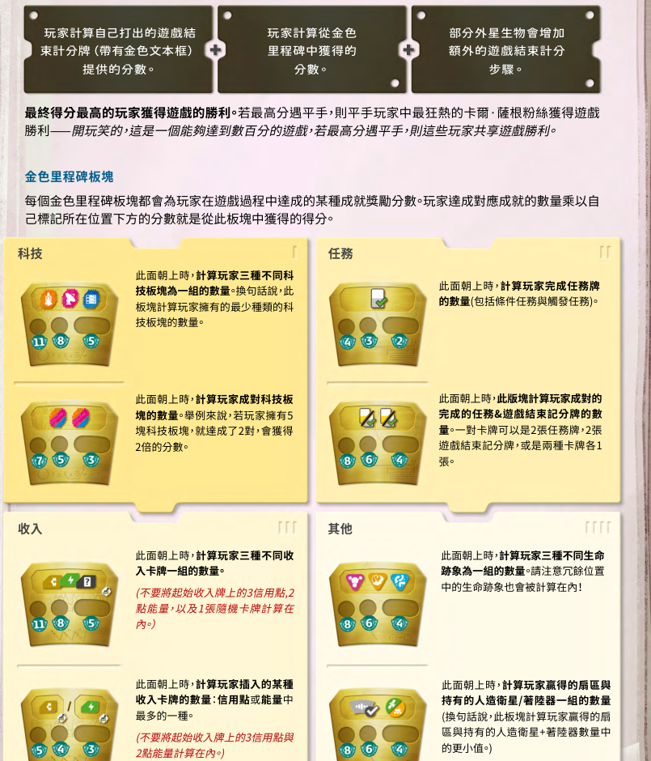

---

## 10. 术语与图标速查


程序实现中可把这些术语统一映射为事件或谓词：

| 规则术语 | 程序化定义建议 |
|---|---|
| 在一个行星执行某行动 | 检查玩家模型是否位于行星版图的行星、轨道或卫星上；太阳系版图中的探测器不算 |
| 在一个扇区执行某行动 | 对目标扇区执行 `markSignal()` |
| 赢得一个扇区 | 执行 `resolveSector()` 后成为 winner |
| 赢得某颜色扇区 | `sector.color == requiredColor && winner == player` |
| 到达一个星球 | 探测器移动进入该星球位置；已经在该位置不算“到达” |
| 拥有某生命迹象 | 玩家在发现位置、外星生物版图或冗余位置放置过对应标记 |
| 同一环上移动 | 移动前后距离太阳的环层不变 |

---

## 11. 本地自动化程序设计建议

### 11.1 推荐做成“规则辅助器”而不是完全 AI 自动代打

这个游戏含有大量卡牌和外星生物特殊效果，完整自动化成本较高。建议分阶段：

1. **阶段 A：状态记录器**
   - 记录玩家资源、手牌数、分数、推广、数据池、模型位置、科技、收入、任务。
   - 提供行动合法性检查。

2. **阶段 B：规则结算器**
   - 自动处理移动消耗、扫描数据、扇区完成、里程碑、收入、跳过、公转。
   - 卡牌效果先用结构化 JSON 手工录入。

3. **阶段 C：策略/提示器**
   - 根据当前状态提示可执行行动。
   - 评估“是否该跳过”“哪个扇区更值得争”“研究哪个科技”。

4. **阶段 D：半自动/全自动模拟器**
   - 用脚本跑多局，测试策略。
   - 可用于本地 AI agent 或启发式算法推荐行动。

### 11.2 核心数据结构

```ts
interface GameState {
  round: 1 | 2 | 3 | 4 | 5;
  currentPlayerId: string;
  startPlayerId: string;
  players: Record<string, PlayerState>;
  solarSystem: SolarSystemState;
  planetBoard: PlanetBoardState;
  sectors: Sector[];
  cardDeck: Deck;
  cardMarket: Card[];
  discardPile: Card[];
  techBoard: TechBoardState;
  aliens: AlienState[];
  milestones: MilestoneState;
  eventLog: GameEvent[];
}
```

```ts
interface PlayerState {
  score: number;
  publicity: number;
  credits: number;
  energy: number;
  hand: Card[];
  incomeCards: Card[];
  dataPool: number;
  computer: ComputerState;
  probeLimit: number;
  probes: Probe[];
  satellites: ModelOnPlanet[];
  landers: ModelOnPlanet[];
  techs: TechTile[];
  completedMissions: Card[];
  endGameScoringCards: Card[];
  passedThisRound: boolean;
}
```

### 11.3 行动系统

建议使用“校验 - 结算 - 触发事件”的三段式：

```ts
interface Action<TPayload> {
  type: string;
  payload: TPayload;
}

function canApply(action: Action<any>, state: GameState): ValidationResult;
function apply(action: Action<any>, state: GameState): GameState;
function emitEvents(action: Action<any>, before: GameState, after: GameState): GameEvent[];
```

常见行动枚举：

```ts
type MainAction =
  | "launch_probe"
  | "orbit_planet"
  | "land_on_planet_or_moon"
  | "scan_nearby_star"
  | "analyze_data"
  | "play_card"
  | "research_tech"
  | "pass_round";

type FreeAction =
  | "move_probe"
  | "place_data_to_computer"
  | "discard_card_for_free_effect"
  | "convert_resources"
  | "buy_card_with_publicity"
  | "complete_mission"
  | "insert_income_card";
```

### 11.4 最重要的自动结算事件

| 事件 | 触发时机 | 自动结算内容 |
|---|---|---|
| `onProbeMoved` | 探测器移动后 | 推广图标、到达触发任务、不能进太阳 |
| `onSignalMarked` | 扇区标记信号后 | 获取数据、第二格 2 分、是否完成扇区 |
| `onSectorCompleted` | 最后一个数据被替换 | 判定赢家/第二名、发奖励、重置扇区 |
| `onDataPlaced` | 数据放入计算机 | 覆盖奖励、收入插入、2 分、推广 |
| `onLifeSignPlaced` | 放置生命迹象 | 1 推广 + 5 分或外星生物版图奖励，检查是否发现外星生物 |
| `onScoreChanged` | 分数变化后 | 回合结束时检查金色/中立里程碑 |
| `onTechResearched` | 研究科技 | 先公转、拿科技、给一次性奖励、翻面放置 |
| `onFirstPassInRound` | 本轮第一位玩家跳过 | 执行太阳系公转 |
| `onRoundEnd` | 所有人跳过 | 收入、传起始玩家、进入下一轮 |

### 11.5 推荐工程目录

```text
seti-helper/
  data/
    cards.json
    tech_tiles.json
    planets.json
    sectors.json
    aliens/
      sulfurites.json
      drillers.json
      anomalies.json
      centaurians.json
      oumuamua.json
  src/
    engine/
      state.ts
      actions.ts
      validators.ts
      reducers.ts
      events.ts
      scoring.ts
    rules/
      movement.ts
      scan.ts
      data.ts
      tech.ts
      alien.ts
      milestones.ts
    ui/
      cli.ts
      web.ts
  tests/
    scan.test.ts
    movement.test.ts
    sector.test.ts
    scoring.test.ts
```

### 11.6 开发优先级

优先实现这些高频、确定性强的规则：

1. 资源支付与获得。
2. 探测器移动与太阳系公转。
3. 扇区标记、完成、重置。
4. 数据池、计算机、分析数据。
5. 里程碑、跳过、轮次维持。
6. 科技板块效果。
7. 卡牌效果 JSON 化。
8. 外星生物模块化。

---

## 12. 易错规则清单

- 研究科技前先执行太阳系公转。
- 每轮第一位玩家跳过时也要执行太阳系公转；第 5 轮也要执行。
- 离开小行星位置通常额外支付 1 移动力。
- 推广上限是 10，超过不保留。
- 数据池上限是 6，满了再获得数据会弃置。
- 将牌插入收入区时立即获得该牌收入奖励，之后每轮继续获得。
- 回合结束后再结算里程碑和外星生物发现。
- 玩家已经跳过后，本轮不能再执行行动。
- 卡牌一次只能选择一种用途。
- 赢得扇区时放在扇区上方的标记，之后不再参与该扇区胜负判定。
- “到达星球”要求探测器移动进入该位置；原本就在该位置不触发。

---

## 13. 最小可行版本 MVP

建议第一个版本不要做图形化自动识别，而是做命令行/网页表单辅助：

```text
1. 选择玩家
2. 选择行动
3. 输入行动参数，例如目标行星/目标扇区/使用的卡牌
4. 程序检查是否合法
5. 自动扣费、发奖励、推进事件
6. 输出本回合结算日志
```

示例日志：

```text
[Round 2][Green] scan_nearby_star
- Pay: 1 credit, 2 energy
- Mark signal in Earth sector: gain 1 data
- Discard market card #2: mark signal in red sector, gain 1 data
- Red sector completed
- Winner: Green, reward: mark landing life sign
- All participants gain 1 publicity
- End turn: Green crosses 25 VP, choose gold milestone
```

这种事件日志后续可以直接喂给本地 Agent，用于策略分析、复盘和自动化调试。
